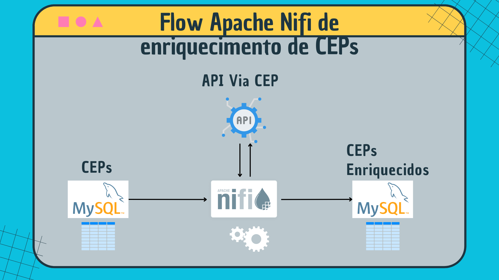

# Flow Apache NIfi de Enriquecimento de CEPs

Neste projeto, mergulho no universo do Apache Nifi, explorando como consumir e salvar dados de uma API diretamente em um banco de dados. Compartilho estratégias práticas e dicas essenciais para uma integração eficiente. Descubra o potencial completo do Apache Nifi enquanto conduzimos juntos essa jornada emocionante de gerenciamento de dados de ponta a ponta.



O Apache NiFi é uma plataforma de integração de dados open-source que oferece uma interface gráfica intuitiva para criar, gerenciar e automatizar fluxos de dados entre sistemas diversos. Destaca-se por sua conectividade expansiva, suportando uma ampla gama de fontes e destinos de dados. Com capacidade de processamento em tempo real, recursos avançados de segurança e extensibilidade, o NiFi é uma escolha popular para casos de uso como ingestão de dados em big data, integração de sistemas e processamento de eventos em tempo real. Sua abordagem visual facilita a configuração mesmo para usuários não técnicos, tornando-o uma ferramenta versátil e poderosa para o gerenciamento eficiente de fluxos de dados em ambientes complexos.

<!--
# Apresentação em vídeo

<p align="center">
  <a href="https://youtu.be/0r4p9u6MSEY" target="_blank"></a>
</p>
-->

### Requisitos

+ 

+ 

+ 

+ 


### Ativando e acessando os serviços

+ Clonando o repositório:

```bash
git clone https://github.com/Renatoelho/apache-nifi-enriquecimento-cep.git apache-nifi-enriquecimento-cep
```

+ Acessando o repositório:

```bash
cd apache-nifi-enriquecimento-cep/
```

+ Ativando as aplicações:

```bash
docker compose -p project-apache-nifi-enriq-cep -f docker-compose.yaml up -d
```

+ URLs de acesso:

|Serviço            |URL/Host           |
|-------------------|--------------| 
|Apache Nifi|[localhost:8443/nifi](http://localhost:8443/nifi)|
|Server MySQL|localhost:3306|

> ***OBS.:*** Credenciais de acesso no arquivo [docker-compose.yaml](docker-compose.yaml).

+ Desativando as aplicações:

```bash
docker compose -p project-apache-nifi-enriq-cep -f docker-compose.yaml down
```

# Referências

Apache/Nifi, ***Docker Hub***. Disponível em: https://hub.docker.com/r/apache/nifi. Acesso em: 06 dez. 2023.

NiFi System Administrator’s Guide, ***Apache NiFi***. Disponível em: https://nifi.apache.org/docs/nifi-docs/html/administration-guide.html. Acesso em: 06 dez. 2023.